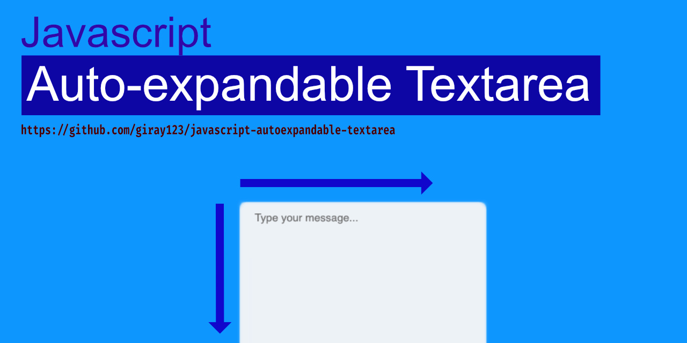
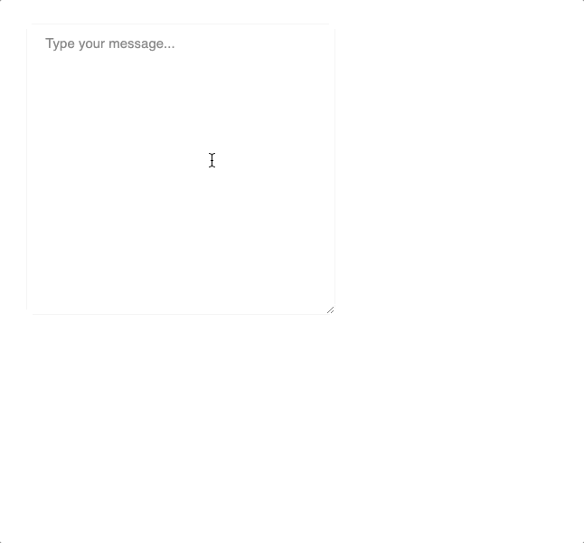
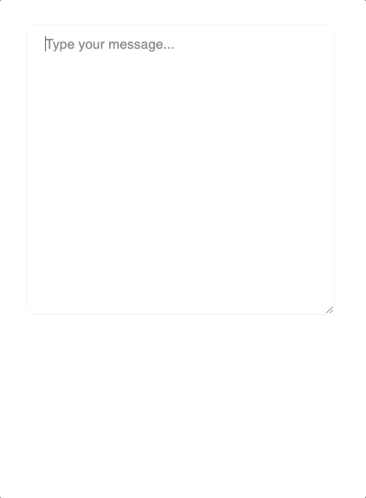

<p align="center"></p>
<h1 align="center">Auto-expandable Textarea for Javascript</h1>
<p align="center">Auto-expandable Textarea snippet for HTML textarea fields built with native javascript</p>
<p align="center">
  
  
  <a href="https://github.com/giray123/javascript-autoexpandable-textarea/blob/master/LICENSE"></a>
</p>

<p align="center"></p>

This snippet:
- :fire:  is built with **native javascript**
- :package: requires **no dependencies**
- :hammer_and_pick: highly **customizable** yet very **simple**

## Demo
- [JSfiddle](https://jsfiddle.net/giray123/y0wh7xmL/12/)
- [Github Pages](https://giray123.github.io/javascript-autocomplete/)
## Usage

Add either unminified or minified JS onto your html
```html
<script src="/js/textarea-expander.js"></script>
<!-- minififed -->
<script src="/js/textarea-expander.min.js"></script>
```

### CDN
You can also use below CDN links. Feel free to change version number with respect to the releases
```html
<script src="https://cdn.jsdelivr.net/gh/giray123/javascript-autoexpandable-textarea@v1.0/js/textarea-expander.js"></script>
<!-- minififed -->
<script src="https://cdn.jsdelivr.net/gh/giray123/javascript-autoexpandable-textarea@v1.0/js/textarea-expander.min.js"></script>

```

Initialize Autocomplete object with your configurations
### Auto-expandable Textarea Both Vertically and Horizontally
<p align="center"></p>

```js
var expander1 = new textAreaAutoExpander('#textarea_expand_both_ways')
```
### Auto-expandable Textarea Vertically
<p align="center"></p>

```js
var expander2 = new textAreaAutoExpander({
    selector: '#textarea_expand_vertically',
    safetyMargin: 200,
    autoHeight: true,
    autoWidth: false
})
```
### Auto-expandable Textarea Horizontally
<p align="center"></p>

```js
var expander3 = new textAreaAutoExpander({
    selector: '#textarea_expand_horizontally',
    safetyMargin: 200,
    autoHeight: false,
    autoWidth: true
})
```
## How it Works?
Auto expanding a textarea based on user input is a tedious task. However, there is a  workaround which this snippet is using. When you initialize the snippet, it creates a copy div element of the textarea which is not possible, it then syncs all the related CSS attributes so that their width and height changes the same amount. When user types, it calculates the width/height of the hidden element and copies it to the textarea. Because of this dynamic, you can not style your textarea during expansion and expect it to continue expanding properly. You need to call `expander.refresh()` after you style your textarea so that the snippet syncs CSS parameters again.

## Configuration
### Global Options
| attribute  | type | default | description |
| -------------       | -------- | ---- | ------------- |
| `selector`            | string   | required | html input element query selector (`document.querySelector(selector)`)
| `safetyMargin`        | integer  | `100`    | minimum distance between text and the border before expanding starts
| `autoHeight`          | boolean  | `true`   | whether to expand vertically
| `autoWidth`           | boolean  | `true`   | whether to expand horizontally
## Methods
| attribute  | description |
| -----------| ----------- |
| `state()`  | returns information about the current state
| `refresh()`| syncs fontFamily, whiteSpace, fontSize, lineHeight between the textarea and the hidden element. You can `expander.refresh({fontSize: 20, lineHeight: 20})` to change fontSize and lineHeight directly


## LICENSE
This project is [licensed]("https://github.com/giray123/javascript-autoexpandable-textarea/blob/master/LICENSE") under the terms of the MIT license.